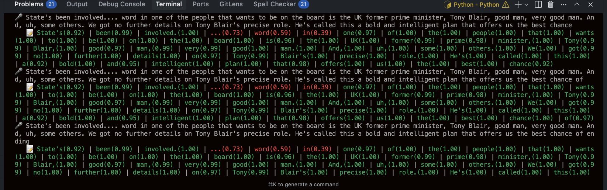

# Deepgram Flux Streaming Transcription Demo

A real-time streaming transcription demo using Deepgram's Flux model. This demo streams live audio from BBC World Service and provides real-time transcription with word-level confidence scoring and color-coded output.

## Getting an API Key

🔑 To access the Deepgram API you will need a [free Deepgram API Key](https://console.deepgram.com/signup?jump=keys).

## Getting Started

### Prerequisites

Before running this demo, make sure you have:

- **Python 3.8+** installed on your system
- **ffmpeg** installed for audio conversion
  - **macOS**: `brew install ffmpeg`
  - **Ubuntu/Debian**: `sudo apt update && sudo apt install ffmpeg`
  - **Windows**: Download from [ffmpeg.org](https://ffmpeg.org/download.html) or use `winget install ffmpeg`

### Installation

1. **Clone the repository:**
   ```bash
   git clone https://github.com/deepgram/deepgram-demos-flux-streaming-transcription.git
   cd deepgram-demos-flux-streaming-transcription
   ```

2. **Install Python dependencies:**
   ```bash
   pip install deepgram-sdk python-dotenv aiohttp ffmpeg-python
   ```

3. **Set up your environment variables:**

   Create a `.env` file in the project root:
   ```bash
   echo "DEEPGRAM_API_KEY=your_deepgram_api_key_here" > .env
   ```

   Replace `your_deepgram_api_key_here` with your actual Deepgram API key.

### Running the Demo

Start the streaming transcription:

```bash
python main.py
```

### What to Expect

The demo will:

1. **Connect** to Deepgram's Flux streaming service
2. **Stream** live audio from BBC World Service
3. **Convert** the audio stream to the correct format using ffmpeg
4. **Display** real-time transcription with:
   - 🎤 Main transcript text
   - 📝 Word-level confidence scores with color coding:




To stop the demo, press `Ctrl+C`.

## Documentation

You can learn more about Deepgram APIs at [developers.deepgram.com](https://developers.deepgram.com/docs).

## Getting Help

We love to hear from you! If you have questions:

- [Join the Deepgram Github Discussions Community](https://github.com/orgs/deepgram/discussions)
- [Join the Deepgram Discord Community](https://discord.gg/xWRaCDBtW4)

[license]: LICENSE.txt
